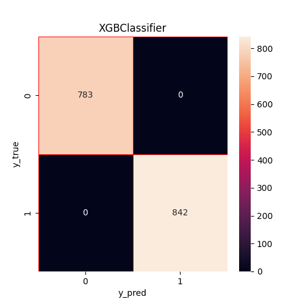

# 🍄 Mushroom Edibility Classification

Progetto di classificazione binaria per predire la **commestibilità dei funghi** (velenosi vs commestibili) attraverso tecniche di Machine Learning tradizionale e Deep Learning, utilizzando il dataset **UCI Mushroom (ID 73)** e con esposizione via **REST API FastAPI** e interfaccia web.

---

## 📋 Indice

- [Panoramica del Progetto](#-panoramica-del-progetto)
- [Dataset](#-dataset)
- [Struttura del Progetto](#-struttura-del-progetto)
- [Pipeline dei Dati](#-pipeline-dei-dati)
- [Modelli Implementati](#-modelli-implementati)
- [Risultati](#-risultati)
- [Salvataggio di Modelli e Risultati](#-salvataggio-di-modelli-e-risultati)
- [API FastAPI](#-api-fastapi)

---

## 🔍 Panoramica del Progetto

L'obiettivo è costruire un classificatore binario in grado di determinare, a partire da caratteristiche morfologiche di un fungo, se esso sia **commestibile (edible)** o **velenoso (poisonous)**.

Il progetto confronta tre approcci distinti:

| Modello | Tipo | Libreria |
|---|---|---|
| XGBoost Classifier | Gradient Boosting | `xgboost` |
| Logistic Regression | Modello Lineare | `scikit-learn` |
| Rete Neurale | Deep Learning | `TensorFlow / Keras` |

A differenza di un'architettura tipica dove si sceglie un solo modello, l'API esegue **tutti e tre i modelli in parallelo** su ogni richiesta e restituisce le tre predizioni in un'unica risposta, permettendo di confrontarle direttamente. I modelli addestrati vengono esposti tramite un'**API REST FastAPI** e consumati da un'**interfaccia web HTML** standalone.
---

## 📊 Dataset

Il dataset utilizzato è il **[UCI Mushroom Dataset](https://archive.ics.uci.edu/dataset/73/mushroom)** (ID: 73), scaricato direttamente tramite la libreria `ucimlrepo`.

### Caratteristiche principali

- **Istanze:** 8.124 campioni
- **Feature:** 22 attributi categorici (forma del cappello, colore, odore, tipo di lamelle, ecc.)
- **Target:** `Edible` → `e` (commestibile) / `p` (velenoso)
- **Missing values:** la colonna `stalk-root` contiene valori nulli, trattati con imputazione per moda

### Feature del Dataset

Le 22 feature originali descrivono caratteristiche morfologiche del fungo, tra cui:
`cap-shape`, `cap-surface`, `cap-color`, `bruises`, `odor`, `gill-attachment`, `gill-spacing`, `gill-size`, `gill-color`, `stalk-shape`, `stalk-root`, `stalk-surface-above-ring`, `stalk-surface-below-ring`, `stalk-color-above-ring`, `stalk-color-below-ring`, `veil-type`, `veil-color`, `ring-number`, `ring-type`, `spore-print-color`, `population`, `habitat`

### Encoding del Target

```
"e" (edible)   → 1
"p" (poisonous) → 0
```

---

## 📁 Struttura del Progetto

```
progetto/
│
├── main.py                  # Entry point: orchestrazione dell'intera pipeline
├── data_manager.py          # Caricamento, pulizia, preprocessing e split dei dati
├── machine_learning.py      # XGBoost Classifier e Logistic Regression
├── deep_learning.py         # Rete neurale con TensorFlow/Keras
├── app.py                   # API REST con FastAPI
│
├── templates/
│   └── index.html           # Interfaccia web per le predizioni
│
├── modelli/                 # Modelli addestrati serializzati
│   ├── preprocessor.pkl
│   ├── xgb_model.pkl
│   ├── logistic_regression.pkl
│   └── deep_learning_model.pkl
│
└── risultati/               # Confusion matrix generate durante il training
    ├── XGBClassifier_confusion_matrix.png
    ├── Logistic Regressor_confusion_matrix.png
    └── Deep Learning_confusion_matrix.png
```

---

## 🔄 Pipeline dei Dati

La gestione dei dati è centralizzata nella classe `DataManager` (`data_manager.py`), che implementa la seguente pipeline:

```
1. load_data()         → Scarica il dataset UCI via API
2. clean_data()        → Imputa i valori nulli in stalk-root (moda)
3. feature_engineering() → Separa X e y, mappa il target in valori numerici
4. build_preprocessor()  → Costruisce il ColumnTransformer con OneHotEncoder
5. split_data()        → Train/Test split stratificato (80/20, random_state=12)
```

### Preprocessing

Tutte le feature sono categoriche, quindi il preprocessing applica **One-Hot Encoding** tramite `sklearn.compose.ColumnTransformer`:

```python
ColumnTransformer(
    transformers=[
        ("cat", OneHotEncoder(drop="first", handle_unknown="ignore", sparse_output=False), X.columns)
    ]
)
```

- `drop="first"` elimina la prima categoria per evitare la multicollinearità
- `handle_unknown="ignore"` gestisce in modo sicuro eventuali categorie non viste in fase di test
- Lo split è **stratificato** per preservare la distribuzione delle classi nel train e nel test set

---

## 🤖 Modelli Implementati

### 1. XGBoost Classifier

Implementato tramite una `sklearn.Pipeline` che combina preprocessore e classificatore.

**Configurazione:**
```python
XGBClassifier(
    eval_metric="logloss",
    random_state=12
)
```

XGBoost è un algoritmo di **gradient boosting** su alberi decisionali. Costruisce iterativamente un ensemble di alberi deboli (weak learners), dove ogni nuovo albero corregge gli errori residui del precedente. La funzione di loss ottimizzata è la **log-loss** (binary cross-entropy), adatta alla classificazione binaria.

---

### 2. Logistic Regression

Anch'essa inserita in una `Pipeline` con il preprocessore.

**Configurazione:**
```python
LogisticRegression()  # parametri di default scikit-learn
```

La regressione logistica è un modello lineare che stima la **probabilità** di appartenenza a una classe tramite la funzione sigmoide:

```
P(y=1 | x) = 1 / (1 + e^(-wᵀx))
```

La classificazione avviene con soglia a 0.5. Nonostante la semplicità, è un baseline molto solido e interpretabile.

---

### 3. Rete Neurale (Deep Learning)

Implementata in `DeepLearningModel` (`deep_learning.py`) utilizzando **TensorFlow/Keras**.

**Architettura:**

```
Input   → [n_features OHE]
Dense   → 128 nodi, ReLU
Dropout → 0.2
Dense   → 64 nodi, ReLU
Dropout → 0.2
Dense   → 32 nodi, ReLU
Output  → 1 nodo, Sigmoid
```

**Compilazione:**
```python
model.compile(
    optimizer="adam",
    loss="binary_crossentropy",
    metrics=["accuracy", "Precision", "Recall"]
)
```

**Training:**
```python
EarlyStopping(monitor="val_loss", patience=20, restore_best_weights=True)
# max epochs=300, batch_size=32, validation_split=0.2
```

Il modello utilizza **Early Stopping** per interrompere il training quando la `val_loss` smette di migliorare per 20 epoche consecutive, ripristinando automaticamente i pesi migliori.

> **Nota:** A differenza dei modelli ML, la rete neurale applica il `fit_transform` del preprocessore internamente alla classe, permettendo una gestione separata rispetto alla Pipeline di scikit-learn.

---

## 📈 Risultati

Per ogni modello viene generata e salvata una **confusion matrix** nella cartella `risultati/`.

Le confusion matrix mostrano la distribuzione di:
- **True Positives (TP):** funghi commestibili classificati correttamente
- **True Negatives (TN):** funghi velenosi classificati correttamente
- **False Positives (FP):** funghi velenosi classificati come commestibili ⚠️
- **False Negatives (FN):** funghi commestibili classificati come velenosi

| Confusion Matrix | |
|---|---|
|  |  |
|  | |

---

Le metriche riportate a console includono per ciascun modello:
- **Accuracy**
- **Precision**
- **Recall**
- **F1-score**
- **Classification Report** completo per classe
 
| Modello | Accuracy | Precision | Recall | F1-score |
|---------|--------|--------|---------|-------|
| Logistic Regression | 1.0 | 1.0 | 1.0 | 1.0 |
| XGBoost Classifier | 1.0 | 1.0 | 1.0 | 1.0 |
| Deep Learning (NN) | 1.0 | 1.0 | 1.0 | 1.0 |
 
---

## 💾 Salvataggio di Modelli e Risultati

Al termine dell'esecuzione, tutti gli artefatti vengono serializzati nella cartella `modelli/` tramite `joblib`:

| File | Contenuto |
|---|---|
| `modelli/preprocessor.pkl` | Il `ColumnTransformer` fittato sul training set |
| `modelli/xgb_model.pkl` | Pipeline completa XGBoost (preprocessor + classifier) |
| `modelli/logistic_regression.pkl` | Pipeline completa Logistic Regression |
| `modelli/deep_learning_model.pkl` | Modello Keras serializzato con joblib |

Le **confusion matrix** (`.png`) vengono salvate automaticamente in `risultati/` durante la fase di valutazione.

---

## 🚀 API FastAPI
 
L'applicazione `app.py` espone i modelli addestrati tramite un'**API REST** costruita con [FastAPI](https://fastapi.tiangolo.com/), un framework Python moderno ad alte prestazioni basato su **ASGI** (Asynchronous Server Gateway Interface).
 
### Concetti chiave di FastAPI
 
**Pydantic e validazione automatica degli input**
 
FastAPI usa i modelli [Pydantic](https://docs.pydantic.dev/) per definire lo schema del corpo della richiesta. I tipi Python vengono usati per validare e serializzare automaticamente i dati in entrata. Il modello `DatiMushrooms` definisce esattamente le 22 feature del dataset come campi obbligatori di tipo `str`:
 
```python
from pydantic import BaseModel
 
class DatiMushrooms(BaseModel):
    cap_shape: str
    cap_surface: str
    cap_color: str
    bruises: str
    odor: str
    # ... tutte le 22 feature
    habitat: str
```
 
Se un campo manca o ha un tipo errato, FastAPI restituisce automaticamente un errore `422 Unprocessable Entity` con dettaglio preciso sul campo problematico.
 
> **Nota sui nomi dei campi:** il dataset UCI usa nomi con trattini (`cap-shape`), mentre Pydantic richiede identificatori Python validi. Il mapping da `cap_shape` → `"cap-shape"` viene gestito esplicitamente dentro l'endpoint, costruendo il DataFrame con le chiavi originali del dataset.
 
**Caricamento dei modelli**
 
I quattro artefatti vengono caricati a **livello di modulo**, cioè una sola volta all'avvio del processo Python, e rimangono in memoria per tutta la durata del server:
 
```python
import joblib
 
modello_logistic_regression = joblib.load("progetto/modelli/logistic_regression.pkl")
modello_deep_learning       = joblib.load("progetto/modelli/deep_learning_model.pkl")
modello_xgb                 = joblib.load("progetto/modelli/xgb_model.pkl")
preprocessor                = joblib.load("progetto/modelli/preprocessor.pkl")
```
 
Questo approccio è semplice ed efficace: evita di ricaricare i modelli a ogni richiesta, che sarebbe estremamente costoso.
 
**Mapping delle predizioni**
 
Le classi numeriche vengono tradotte in etichette leggibili tramite un dizionario:
 
```python
class_names = {
    0: "Velenoso",
    1: "Edibile"
}
```
 
**Preprocessing differenziato**
 
Un aspetto chiave dell'implementazione è che XGBoost e Logistic Regression sono salvati come **Pipeline scikit-learn** (preprocessore + modello), quindi ricevono direttamente il DataFrame grezzo. La rete neurale invece è salvata come **modello Keras puro**, quindi il preprocessore deve essere applicato manualmente prima della predizione:
 
```python
# XGBoost e Logistic Regression: il preprocessore è interno alla Pipeline
preditcion_logistic_regression = modello_logistic_regression.predict(mushrooms)[0]
preditcion_xgb                 = modello_xgb.predict(mushrooms)[0]
 
# Deep Learning: preprocessing manuale, poi predizione con soglia 0.5
mushrooms_processed = preprocessor.transform(mushrooms)
prediction_deep_learning_raw = modello_deep_learning.predict(mushrooms_processed)
prediction_deep_learning = (
    (prediction_deep_learning_raw[0][0] > 0.5).astype(int)
    if prediction_deep_learning_raw.ndim == 2
    else int(prediction_deep_learning_raw[0] > 0.5)
)
```
 
La gestione del `ndim` rende il codice robusto sia nel caso in cui Keras restituisca un array 2D `[[0.97]]` (output shape `(1,1)`) sia 1D `[0.97]` (output shape `(1,)`).
 
### Endpoints disponibili
 
| Metodo | Endpoint | Descrizione |
|---|---|---|
| `GET` | `/` | Messaggio di stato — conferma che l'API è attiva |
| `POST` | `/predict` | Riceve le 22 feature, restituisce le predizioni di tutti e 3 i modelli |
| `GET` | `/docs` | Documentazione Swagger UI (generata automaticamente da FastAPI) |
| `GET` | `/redoc` | Documentazione ReDoc alternativa |
 
### Schema della richiesta a `/predict`
 
Il body della richiesta deve essere un oggetto JSON con **tutti e 22 i campi** di `DatiMushrooms`. I valori devono corrispondere a quelli presenti nel dataset UCI (es. `"convex"`, `"smooth"`, `"almond"`):
 
```json
{
  "cap_shape": "convex",
  "cap_surface": "smooth",
  "cap_color": "brown",
  "bruises": "yes",
  "odor": "almond",
  "gill_attachment": "free",
  "gill_spacing": "close",
  "gill_size": "broad",
  "gill_color": "black",
  "stalk_shape": "enlarging",
  "stalk_root": "equal",
  "stalk_surface_above_ring": "smooth",
  "stalk_surface_below_ring": "smooth",
  "stalk_color_above_ring": "white",
  "stalk_color_below_ring": "white",
  "veil_type": "partial",
  "veil_color": "white",
  "ring_number": "one",
  "ring_type": "pendant",
  "spore_print_color": "black",
  "population": "scattered",
  "habitat": "woods"
}
```
 
### Schema della risposta `/predict`
 
L'API restituisce **simultaneamente le predizioni di tutti e tre i modelli** in un unico oggetto JSON:
 
```json
{
  "prediction_logistic_regression": "Edibile",
  "prediction_xgb": "Edibile",
  "prediction_deep_learning": "Edibile"
}
```
 
| Campo | Tipo | Descrizione |
|---|---|---|
| `prediction_logistic_regression` | `str` | Predizione della Logistic Regression |
| `prediction_xgb` | `str` | Predizione di XGBoost |
| `prediction_deep_learning` | `str` | Predizione della rete neurale |
 
I valori possibili per ogni campo sono `"Edibile"` oppure `"Velenoso"`.
 
### Avviare il server
 
```bash
uvicorn app:app --reload --host 0.0.0.0 --port 8000
```
 
- `--reload` abilita il riavvio automatico a ogni modifica del codice (solo sviluppo)
- Il server sarà disponibile su `http://localhost:8000`
- La documentazione interattiva su `http://localhost:8000/docs`
---
 
## ▶️ Utilizzo
 
### 1. Avviare l'API
 
```bash
uvicorn app:app --reload --host 0.0.0.0 --port 8000
```
 
### 2. Usare l'interfaccia web
 
Aprire il browser su `http://localhost:8000`, compilare le feature del fungo e cliccare **Predict**.
 
### 3. Chiamata diretta all'API (cURL)
 
```bash
curl -X POST "http://localhost:8000/predict-json" \
  -H "Content-Type: application/json" \
  -d '{
    "cap_shape": "convex",
    "cap_surface": "smooth",
    "cap_color": "brown",
    "bruises": "yes",
    "odor": "almond",
    "gill_attachment": "free",
    "gill_spacing": "close",
    "gill_size": "broad",
    "gill_color": "black",
    "stalk_shape": "enlarging",
    "stalk_root": "equal",
    "stalk_surface_above_ring": "smooth",
    "stalk_surface_below_ring": "smooth",
    "stalk_color_above_ring": "white",
    "stalk_color_below_ring": "white",
    "veil_type": "partial",
    "veil_color": "white",
    "ring_number": "one",
    "ring_type": "pendant",
    "spore_print_color": "black",
    "population": "scattered",
    "habitat": "woods"
  }'
```
 
Risposta attesa:
 
```json
{
  "prediction_logistic_regression": "Edibile",
  "prediction_xgb": "Edibile",
  "prediction_deep_learning": "Edibile"
}
```
 
---
## Come eseguire il progetto

1. Clonare la repository:

```bash
git clone <repo-url>
cd <repo-name>
```

2. Costruire l'immagine Docker:

```bash
docker build -t funghi-api .
```

3. Avviare il container:

```bash
docker run -p 8077:8000 --name docker-funghi funghi-api:latest
```

4. Aprire nel browser:

```
http://localhost:8077
```
---
 
## 🛠️ Tecnologie Utilizzate
 
| Libreria | Utilizzo |
|---|---|
| `ucimlrepo` | Download automatico del dataset UCI |
| `pandas` | Manipolazione e gestione dei dati |
| `scikit-learn` | Preprocessing, ML models, metriche |
| `xgboost` | Gradient Boosting Classifier |
| `tensorflow` / `keras` | Rete neurale deep learning |
| `matplotlib` / `seaborn` | Visualizzazione confusion matrix |
| `joblib` | Serializzazione dei modelli |
| `fastapi` | Framework REST API asincrono |
| `uvicorn` | Server ASGI per FastAPI |
| `pydantic` | Validazione e serializzazione degli input |
